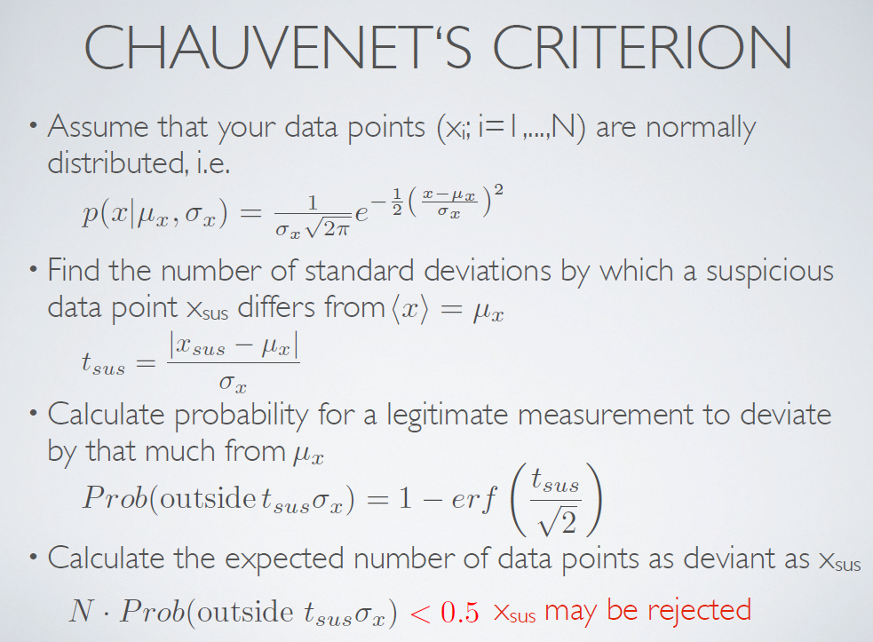

# Chauvenet's criterion

## Precaution

**Must be used with cuation!**  
See literature (google for it ;-)) for reasons why this can lead to wrong results.  
Outliers should be observed by the operator (human being) and then a decision can be taken wheter the outliere can be removed or not.

## Description

0.5 is used because of symmetry in the normal distribution.
