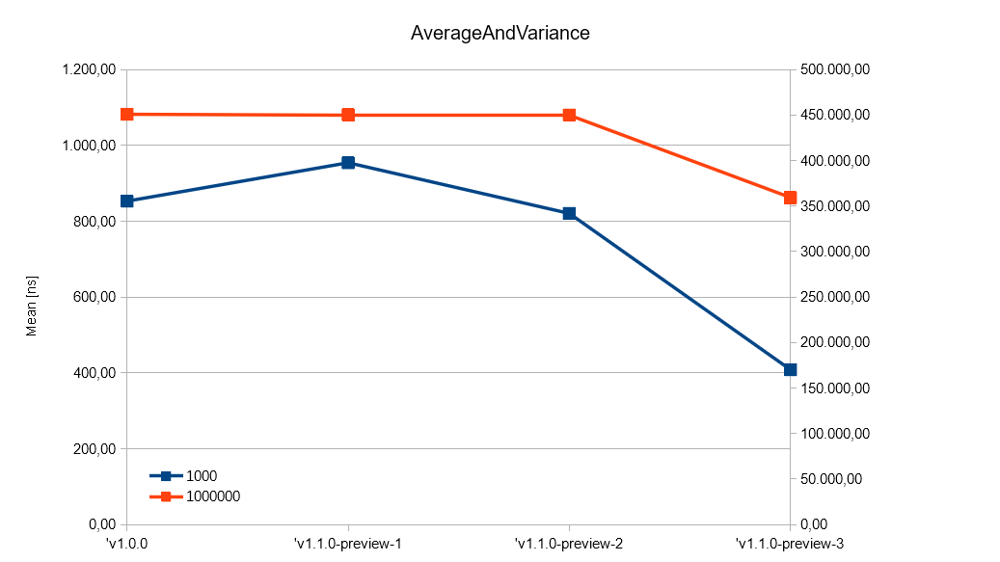

# Release Notes for v1.1.0

## Overview

This release introduced explicit support for `netcoreapp2.1`, and is mainly focused on perf-improvements over v1.0.0. Some key-points are:

* improved SIMD reduction [#49](https://github.com/gfoidl/Stochastics/pull/49)
* loop unrolling "eats" more iterations [#52](https://github.com/gfoidl/Stochastics/pull/52)
* extensively used intruction level parallelism (ISP) [#57](https://github.com/gfoidl/Stochastics/pull/57)
* SIMD operations are done aligned to register size [#60](https://github.com/gfoidl/Stochastics/pull/60)

## Perf-improvement

Perf improved about `+25...+200%` (depending on data-size, whether parallelized compuation is done or not, and so on).
As example a graph for the combined compuation of _average_ and _variance_ is shown.

